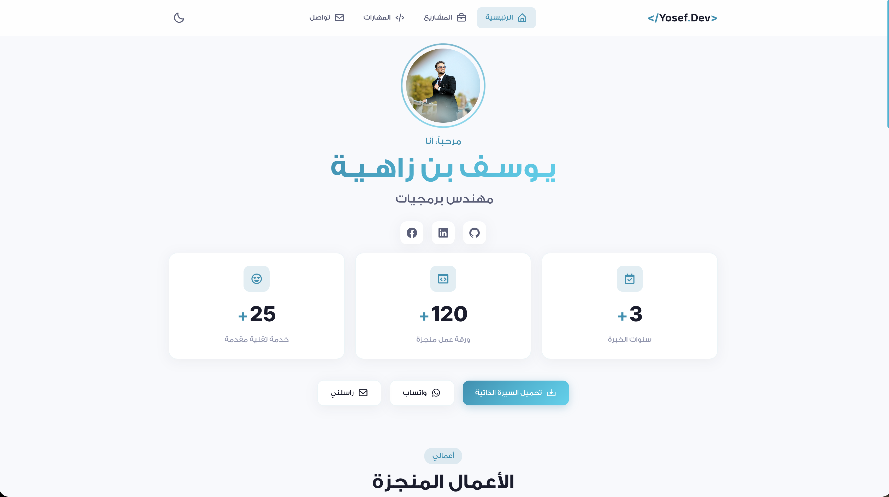

<p align="center">
  
</p>

<h1 align="center">يـوسـف بن زاهـيـة — Portfolio</h1>

<p align="center">
  <strong>Software Engineer · Application Developer · Banking Network Developer</strong>
</p>

<p align="center">
  <a href="#-features"></a>
  
  
  
</p>

---

## 📋 About

A modern, responsive, and visually stunning personal portfolio website showcasing my professional projects, technical skills, and experience as a **Software Engineer** and **Banking Network Developer**. Built with pure HTML5, CSS3, and Vanilla JavaScript — no frameworks, no dependencies.

---

## ✨ Features

| Feature | Description |
|---------|-------------|
| 🌗 **Dark / Light Mode** | Toggle between themes with smooth transitions |
| ⌨️ **Typing Animation** | Dynamic typing effect showcasing specializations |
| 📊 **Animated Statistics** | Counter animations triggered on scroll |
| 🃏 **Project Cards** | Elegant project showcase with hover effects |
| 🛡️ **Form Validation** | Client-side contact form with real-time validation |
| 📱 **Fully Responsive** | Optimized for all screen sizes and devices |
| 🎭 **Micro-Animations** | Smooth reveal-on-scroll and interactive transitions |
| 🔝 **Scroll to Top** | Floating button for quick navigation |

---

## 🚀 Projects Showcased

- **تطبيق بنيان** — Construction services app with bank card payments & Google Maps integration
- **نظام بنيان للمبيعات والمحاسبة** — Full-stack sales & accounting system
- **11 يونيو — مصرف شمال افريقيا** — Branch network infrastructure setup
- **زوارة — مصرف شمال افريقيا** — Branch network infrastructure setup
- **الإدارة العامة — مصرف شمال افريقيا** — Technical support & field visits
- **الخدمات الإلكترونية — مصرف شمال افريقيا** — E-services department setup

---

## 🛠️ Tech Stack

### Portfolio Website
```
HTML5 · CSS3 · Vanilla JavaScript
```

### Projects Built With
```
Flutter · Dart · Laravel · React · PostgreSQL · Google Maps API · Plutu API
```

---

## 📁 Project Structure

```
Yosef_Portfolio/
├── assets/
│   ├── images/         # Project screenshots & profile photo
│   ├── fonts/          # Custom Arabic fonts (GE SS Two)
│   └── cv.pdf          # Downloadable resume
├── index.html          # Main HTML structure
├── style.css           # Complete styling & animations
├── script.js           # Interactive functionality
├── .gitignore
├── CNAME               # Custom domain configuration
├── LICENSE
└── README.md
```

---

## 🔒 License & Usage

This project is **Proprietary**. All rights are reserved by **Yosef Ben Zahia** (Ben Zahia Holding). 

**Unauthorized reproduction, modification, or distribution of this code, design, or content is strictly prohibited.** This repository exists for portfolio showcasing and educational review only. Use of this code for commercial or personal projects without explicit written permission is forbidden.

---

<p align="center">
  Made with ❤️ by <strong>Yosef Ben Zahia</strong> · © 2026 Ben Zahia Holding. All rights reserved.
</p>
